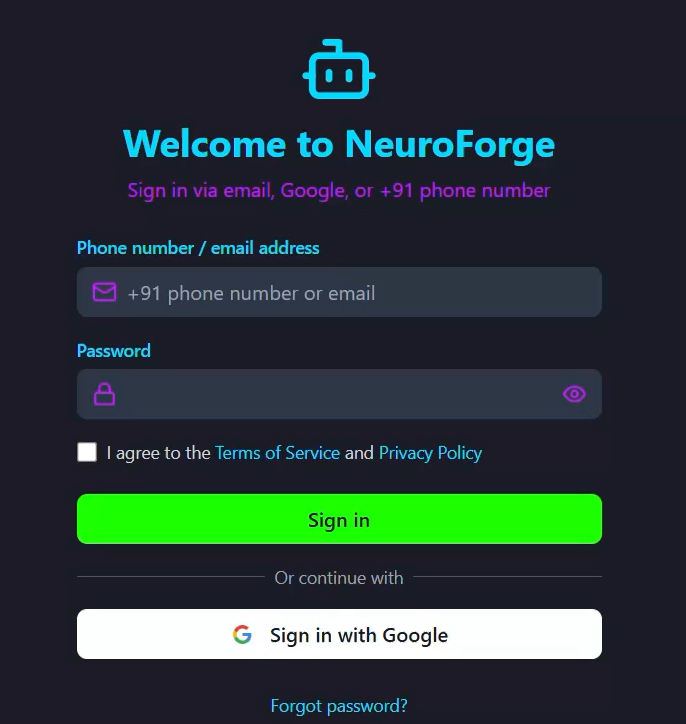

# Neuroforge AI Assistant 🤖

A next-generation conversational AI assistant with natural language processing capabilities, designed for seamless integration across multiple platforms.

 <!-- Replace with actual thing -->

## ✨ Features

- **Natural Language Understanding**  
  Advanced NLP processing powered by state-of-the-art language models
- **Multi-Platform Support**  
  Ready for web, mobile, and desktop integration
- **Contextual Awareness**  
  Maintains conversation context for meaningful dialogues
- **Easy Customization**  
  Modular architecture for rapid feature development
- **Secure Authentication**  
  OAuth 2.0 integration with major identity providers

## 🚀 Quick Start

### Prerequisites
Before you begin, ensure you have the following installed and configured:

- Core Technologies
Python 3.8+: The backend is built using Python.
Download: https://www.python.org/downloads/

Node.js (v16+) and npm: Required for the React frontend.
Download: https://nodejs.org/

- Frontend
React.js: The frontend is built using React.
Install: npx create-react-app your-app-name

Tailwind CSS: For styling the UI components.
Install: npm install -D tailwindcss postcss autoprefixer
Setup: https://tailwindcss.com/docs/installation

- Backend
Flask/FastAPI: For building RESTful APIs.
Install: pip install flask or pip install fastapi

Hugging Face Transformers: For working with pre-trained language models.
Install: pip install transformers

Local Hosting

LangChain: For chaining LLM workflows.
Install: pip install langchain

- Machine Learning & AI
PyTorch/TensorFlow: For deep learning and model fine-tuning.
Install: pip install torch or pip install tensorflow

Hugging Face Models: Access pre-trained models from Hugging Face.
Install: pip install transformers

LLMs (Large Language Models): GPT, Llama, or other open-source LLMs.
Example: pip install llama-cpp-python for Llama models.

- Cloud & Deployment
Docker: For containerization.
Install: https://docs.docker.com/get-docker/

Cloud Services: AWS, GCP, or Azure for deployment.
Example: AWS CLI: pip install awscli

Netlify/Vercel: For frontend deployment.
Sign up: https://www.netlify.com/ or https://vercel.com/

- APIs & Integrations
RESTful API Knowledge: For integrating backend services.
Example: pip install requests

OAuth 2.0: For secure authentication.
Example: pip install authlib

- Open Source Tools
Git: For version control.
Install: https://git-scm.com/

VS Code: Recommended IDE.
Download: https://code.visualstudio.com/

- Additional Libraries
NumPy & Pandas: For data manipulation.
Install: pip install numpy pandas

Scikit-learn: For machine learning utilities.
Install: pip install scikit-learn
